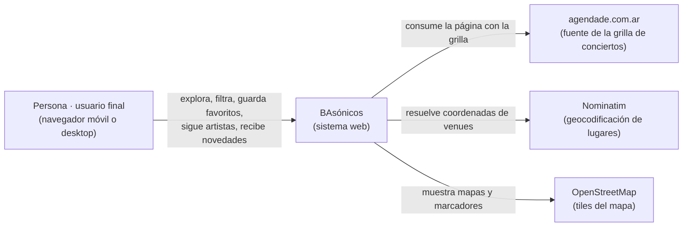
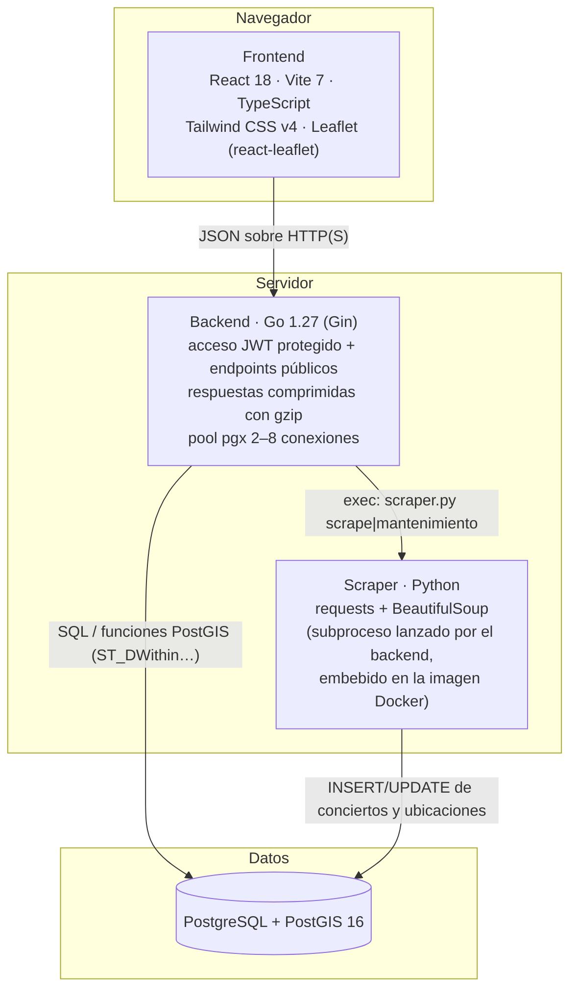
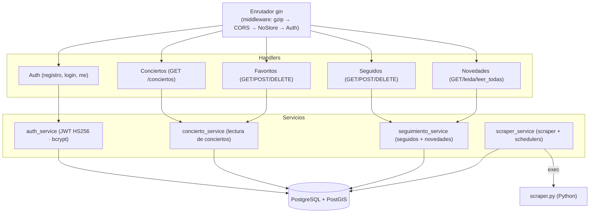
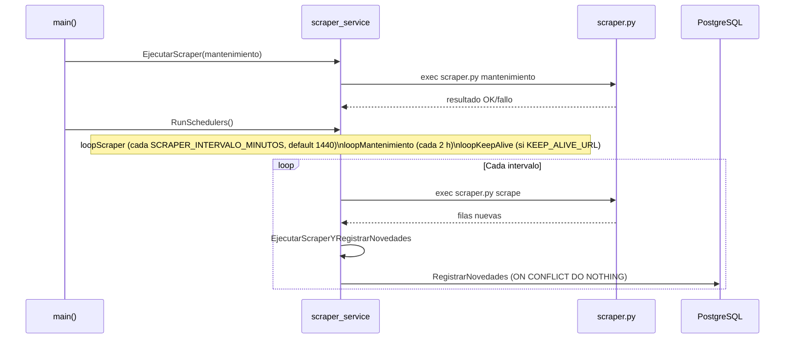

# Arquitectura de BAsónicos

Diagramas de arquitectura del sistema en estilo C4 (contexto → contenedores → componentes).
Los diagramas usan **Mermaid** y se renderizan en GitHub, GitLab y editores con soporte Mermaid.

## 1. Contexto (C1)

## 2. Contenedores (C2)

## 3. Componentes del backend (C3)

## 4. Procesos en segundo plano

`RunSchedulers` (en `backend/internal/services/scraper_service.go`) arranca tres goroutines:

> `RegistrarNovedades` inserta notificaciones para los usuarios que siguen al artista de
> cualquier concierto nuevo ingresado **desde el último scrape** (`cn.creado_en >= desde`),
> de forma **idempotente** (`UNIQUE(usuario_id, concierto_id)`).

## 5. Despliegue (Render)

- **Backend**: servicio web con `runtime: docker` (`render.yaml`, servicio
  *bassonicos-backend*). El `backend/Dockerfile` empaqueta el binario Go + Python 3
  + el scraper (`PYTHON_CMD`, `SCRAPER_PATH` y `SCRAPER_RUN_DIR` fijos en la
  imagen). El scraper corre como subproceso del backend cada 24 h
  (`SCRAPER_INTERVALO_MINUTOS=1440`) y **no se expone por URL**. `PORT=10000`,
  base externa Postgres con `DB_SSLMODE=require`, health check en `/`.
- **Frontend**: servicio estático (*bassonicos-frontend*) que sirve `./dist`
  (build de `npm run build`) y apunta a `VITE_API_URL`.
- **Vigilancia**: el plan free duerme la instancia ~15 min sin tráfico; un
  UptimeRobot/cron-job.org pinguea el health check del backend (`/`) cada ~10 min
  para que el loop de 24 h del scraper se dispare.

## 6. Decisiones de estructura recientes

- Endpoints sin consumidor (`/ubicaciones`, `/conciertos_cerca`) eliminados: la cercanía se
  calcula en el cliente con la fórmula del haverseno sobre `/conciertos`.
- Lectura de filas de conciertos unificada en `filaConcierto` (conciertos, favoritos y
  novedades comparten el mismo escaneo).
- Servicios frontend unificados en `src/servicios/http.ts` (`peticion`, `ErrorApi`,
  `API_BASE_URL`), eliminando tres copias duplicadas.