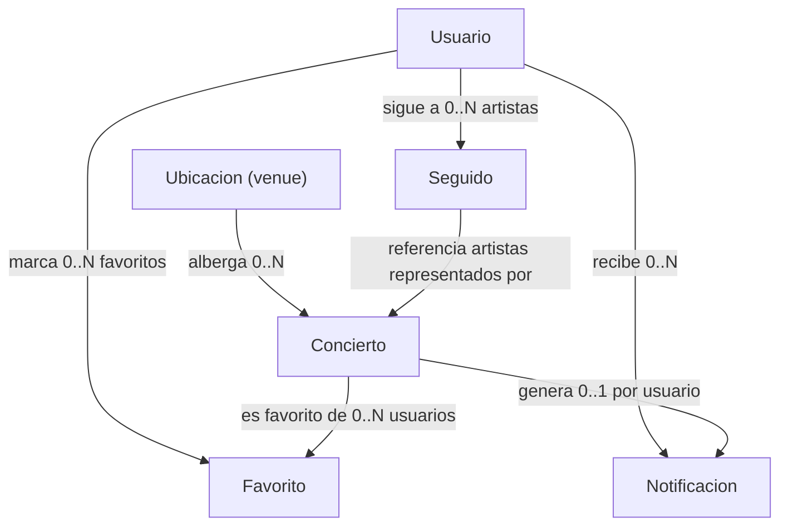

# Base de datos · BAsónicos

PostgreSQL 16 con PostGIS. Documentos el modelo conceptual (**DEIR**) y el lógico
(**DER**). El DDL real vive en `backend/internal/db/db.go` (idempotente: `CREATE TABLE IF
NOT EXISTS` + `CREATE INDEX IF NOT EXISTS` y `CREATE EXTENSION IF NOT EXISTS postgis`).

## 1. Modelo conceptual (DEIR)

Entidades e interrelaciones (sin atributos, nivel conceptual):

| Entidad | Descripción |
| --- | --- |
| `Ubicacion` | Lugar físico donde ocurren conciertos (venue). |
| `Concierto` | Evento musical con fecha, hora y disponibilidad. |
| `Usuario` | Cuenta registrada con credenciales. |
| `Favorito` | Interrelación **N:M** entre Usuario y Concierto. |
| `Seguido` | Interrelación **N:M** entre Usuario y Artista (del Concierto). |
| `Notificacion` | Aviso de concierto nuevo de un artista seguido (por Usuario y Concierto). |



## 2. Modelo lógico (DER)

```mermaid
erDiagram
    UBICACIONES {
        SERIAL id PK
        VARCHAR(50) nombre
        INTEGER capacidad_total
        GEOMETRY coordenadas
        VARCHAR(100) url_maps
    }
    CONCIERTOS {
        SERIAL id PK
        VARCHAR(50) nombre
        VARCHAR(50) artista
        VARCHAR(100) url_evento
        INTEGER ubicacion FK
        BOOLEAN isagotado
        BOOLEAN isaptomenores
        DATE fecha
        TIME hora
        TIMESTAMPTZ creado_en
    }
    USUARIOS {
        SERIAL id PK
        TEXT email UNIQUE
        TEXT nombre
        TEXT password_hash
        TIMESTAMPTZ creado_en
    }
    FAVORITOS {
        INTEGER usuario_id PK,FK
        INTEGER concierto_id PK,FK
        TIMESTAMPTZ creado_en
    }
    SEGUIDOS {
        SERIAL id PK
        INTEGER usuario_id FK
        TEXT artista
        TIMESTAMPTZ creado_en
    }
    NOTIFICACIONES {
        SERIAL id PK
        INTEGER usuario_id FK
        INTEGER concierto_id FK
        BOOLEAN leida
        TIMESTAMPTZ creado_en
    }

    UBICACIONES ||--o{ CONCIERTOS : "1..N"
    USUARIOS ||--o{ FAVORITOS : ""
    CONCIERTOS ||--o{ FAVORITOS : ""
    USUARIOS ||--o{ SEGUIDOS : ""
    USUARIOS ||--o{ NOTIFICACIONES : ""
    CONCIERTOS ||--o{ NOTIFICACIONES : ""
```

### Restricciones y cardinalidades

| Tabla | Clave primaria | Claves foráneas | Unicidad | Borrado |
| --- | --- | --- | --- | --- |
| `ubicaciones` | `id` | — | — | — |
| `conciertos` | `id` | `ubicacion → ubicaciones.id` | — | `ON DELETE CASCADE` del venue borra conciertos |
| `usuarios` | `id` | — | `email` | — |
| `favoritos` | `(usuario_id, concierto_id)` | `usuario_id → usuarios.id`, `concierto_id → conciertos.id` | PK compuesta | `CASCADE` |
| `seguidos` | `id` | `usuario_id → usuarios.id` | `(usuario_id, artista)` | `CASCADE` |
| `notificaciones` | `id` | `usuario_id → usuarios.id`, `concierto_id → conciertos.id` | `(usuario_id, concierto_id)` | `CASCADE` |

- **Favorito**: interrelación N:M con atributo `creado_en` → tabla puente con PK compuesta.
- **Seguido**: el artista se guarda como texto normalizado (`lower(btrim(...))`), y la
  unicidad `(usuario_id, artista)` hace que seguir sea **idempotente** (`ON CONFLICT DO NOTHING`).
- **Notificacion**: 1..1 entre `(usuario_id, concierto_id)` → un aviso por par, insertado
  por `RegistrarNovedades` con `ON CONFLICT (usuario_id, concierto_id) DO NOTHING`.
- `coordenadas` es `GEOMETRY(POINT, 4326)` (PostGIS) para consultas espaciales y
  `ST_X/ST_Y` al serializar.

## 3. Índices

| Índice | Columnas | Sirve para |
| --- | --- | --- |
| `idx_conciertos_ubicacion` | `conciertos(ubicacion)` | JOIN con `ubicaciones` |
| `idx_conciertos_fecha` | `conciertos(fecha, hora)` | ordenamiento por fecha (favoritos) |
| `idx_conciertos_artista_lower` | `conciertos(lower(btrim(artista)))` | match de artistas (novedades/seguidos) |
| `idx_favoritos_concierto` | `favoritos(concierto_id)` | FK y borrado de conciertos |
| `idx_notificaciones_usuario` | `notificaciones(usuario_id, leida, creado_en DESC)` | listado y conteo no leídas |
| `idx_notificaciones_concierto` | `notificaciones(concierto_id)` | FK y borrado de conciertos |

La PK compuesta `(usuario_id, concierto_id)` de `favoritos` y la única
`(usuario_id, artista)` de `seguidos` cubren las consultas por usuario (prefijo).

## 4. Datos de ejemplo actuales

| Tabla | Filas |
| --- | --- |
| `conciertos` | 263 |
| `usuarios` | 7 |
| `seguidos` | 1 |
| `notificaciones` | 0 (se crean post-scrape) |